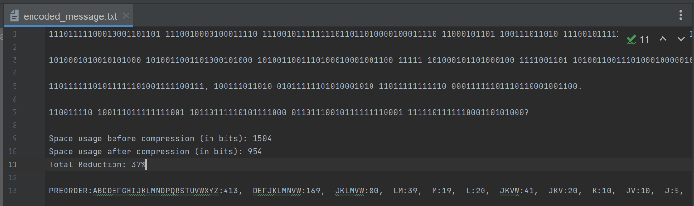
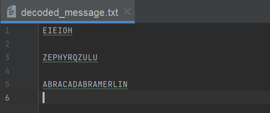
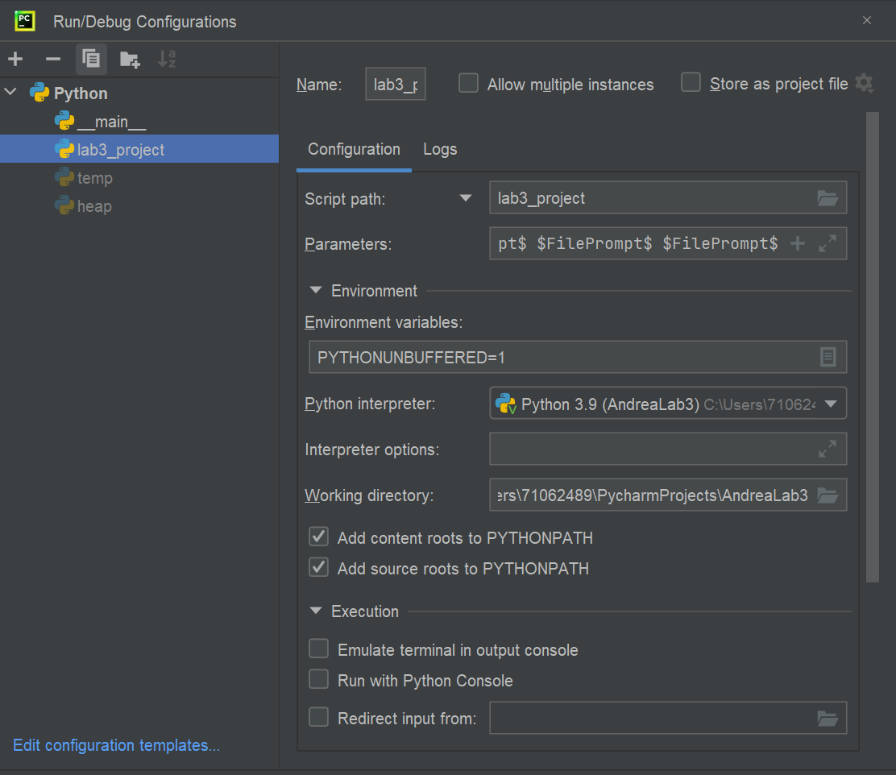

# Huffman Encoder - Lab 3 - Dana Andrea
### Description

Python Version: 3.9 

This program builds a huffman encoding tree using a frequency table .csv provided by the user. After building the tree,
this program encodes the leaf nodes and can be used to encode or decode messages provided by the user. 

### What is huffman encoding? 
Huffman encoding is a type of data compression technique. Using a frequency table, shorter codes  are assigned 
to more frequently occurring symbols and longer codes are assigned to less frequently occurring symbols. 

Using this method, we can represent text documents using fewer bits than if you used a fixed-length code for each 
symbol (e.g. "A" always represented by "00", "B" always represented by "01", etc.). This can result in significant 
compression of the original data, which can be useful for storage and transmission purposes.

It also has a secondary effect of encrypting the data. However, this is not used as an encryption technique for 
real-world applications. 

### Error Handling
1. If any of the required input files does not exist, an exception is raised and the program exits. 
2. If the frequency table, encoding table, or decoding table are empty, program exits with message that they are empty. 
3. When creating the leaf nodes, the program checks if a node already exists for that character. If that character
already has a node, then the duplicate character is skipped.

### Example of the Output Files: Encoded Output and Decoded Output
This program returns two files. 

The first one is the encoded message which contains the encoded message, preorder traversal, and compression statistics. 



The second file that is generated is the decoded message. This just contains the decoded messages.



### How to run this package from pyCharm
1. Open AndreaLab3 in PyCharm. 
2. Add a configuration for package lab3_project with **5** file prompt parameters as below. First parameter is frequency
table (FreqTable.txt), second parameter is file with text to encode (ClearText.txt), the third parameter is file with 
text to decode (Encoded.txt), fourth parameter is file location where you want to save your encoded message
(encoded_message.txt), and fifth parameter is file location where you want to save your decoded message 
(decoded_message.txt).  **All 5 parameters are required.**
3. Set working directory to AndreaLa3/lab3_project as below. 
4. Run the module and select your  file locations from your own directory (or resources file provided)
5. Open encoded_message.txt or decoded_message.txt to see the converted expressions. 



### How to run this package from command line 
```commandline
usage: python -m lab3_project frequency_table clear_text encoded_text encoded_message decoded_message  

positional arguments:
  frequency_text     Frequency Table File Pathname
  text_to_encode     ClearText File Pathname
  text_to_decode     Encoded File Pathname
  encoded_text       encoded_message Pathname
  decoded_text       decoded_message Pathname
```

```commandline
usage: python -m frequency_generator clear_text freq_table  

positional arguments:
  clear_text        Text to turn into frequency table
  freq_table        Location to write frequency table to
```


### Test Data Inputs
Files that can be encoded: ClearTxt, shakespeare 

Files that can be decoded: Encoded, additional_encoding

Frequency Tables: FreqTable, Cornell_Freq_Table, Morrison_Freq_Table, Freq_Table_Clear_Text

### Enhancements 
1. Write encoded message to different file than decoded message
2. Added compression statistics to encoded file (assuming every letter is 8 bits)
3. Frequency Table Generator in new module
3. Additional Frequency tables for the Cornell Analysis of English Language, Toni Morisson's Nobel Prize Speech, and
a frequency table created based on the ClearText itself.
4. Alphabetize function to facilitate node merges. 